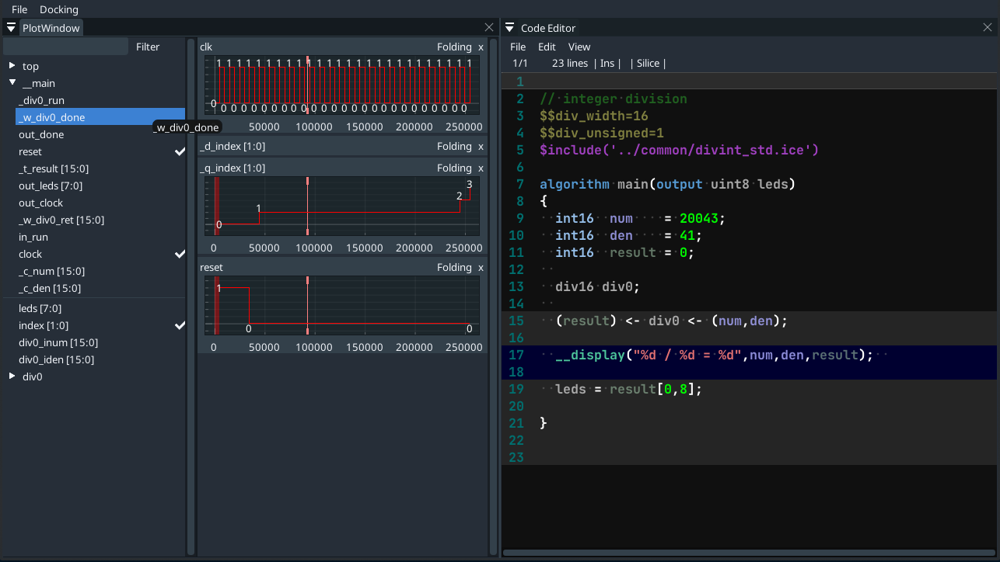
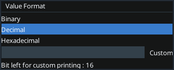

# Silice debugger

*This is the debugger developed for Silice*

# Usage

### Plot Window

In the plot window, you can select on the left which signal to display.

You can customize the plots by right-clicking on them to change the values' format.

You can also change colors by right clicking on the scope name.

### Code Editor

The code editor is giving you informations about your code. The variables' color depends on their type (temp, wire,
...).

If you place your mouse on them, the type will be displayed.

The background color is also important and depends on _q_index and the marker's position.

# Installation

Undefine **test_env** in sourcePath.in (root directory) to change the way the debugger is looking for files.

**test_env** is defined : silice-debugger will be looking for /examples/divstd_bare/ (divstd_bare can be found <a href="https://github.com/sylefeb/Silice/tree/master/projects/divstd_bare">here</a>).

**test_env** is not defined : silice-debugger will consider that you are using *make debug* from a Silice design directory.
